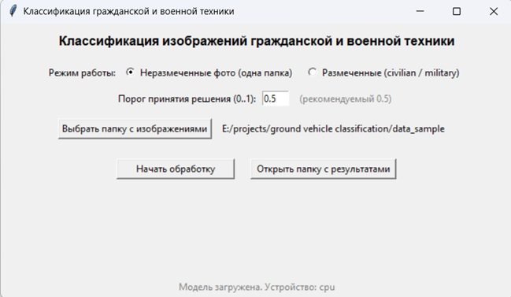
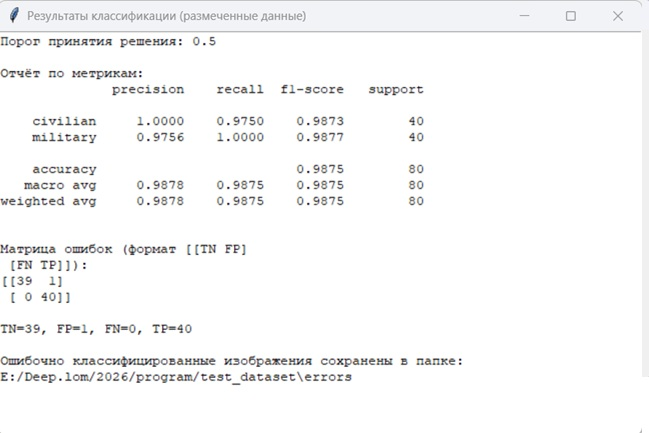
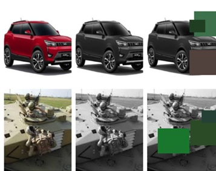

# Ground Vehicle Classification (Civilian vs Military)

Binary classification of civilian and military ground vehicles from aerial images using EfficientNet-B0 (PyTorch).  
Классификация гражданской и военной наземной техники по аэрофотоснимкам.

## Demo

- **Demo video:** [https://drive.google.com/file/d/1iHT_Q8vEJMhjnS3nvL7Qrp6i-m1y28T2/view?usp=drive_link]  
- **Screenshots:**
  - Main GUI: 
  - Metrics window: 
  - Augmentation examples: 

## Dataset structure

```text
vehicle_dataset/
  civilian/
    *.jpg
  military/
    *.jpg
```

The full dataset is not included in this repository due to its size.  
A small sample is available in `data_sample/` (if provided).

## Installation

```bash
pip install -r requirements.txt
```

## Usage

### Training

```bash
cd src
python train.py
```

### GUI application

```bash
cd src
python gui_app.py
```

### Inference (optional)

```bash
cd src
python inference.py
```

## Project structure

```text
ground-vehicle-classification-cnn/
  README.md
  requirements.txt
  .gitignore
  src/
    train.py
    inference.py
    gui_app.py
  data_sample/        (optional small sample)
  screenshots/
  models/
```

## Model and Windows binary

Pretrained model and prebuilt Windows executable (.exe) are available separately:

- **Google Drive:** [https://drive.google.com/file/d/1kNIvYf74D4j0HpvFf_1uq5NGr0C7am79/view?usp=drive_link]

To use:

1. Download `best_efficientnet_b0_aug2_newdataset.pth` into `models/`.  
2. Run the GUI:
   - from source: `python src/gui_app.py`, or  
   - using the executable: `VehicleClassifier.exe`.

## Author

Alexandr Knyazev  
Master’s in Software Engineering (AI Systems), Mari State University, 2026.